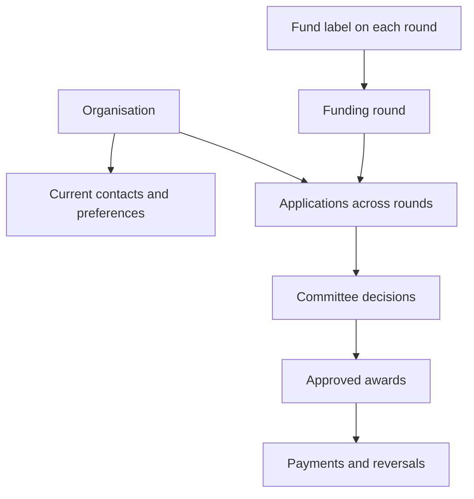

# Rotary Grants proposal

Adapted from the original build pack prepared for Marcus Judge on 2 October
2026, after reviewing it against the actual Tree of Light codebase (see
`docs/grants-discovery.md`) and the owner's own correction that this system is
not scoped to Tree of Light alone. This is an implementation brief; it is not an
installed or tested plugin yet.

## Recommendation

Build **Rotary Grants** as a separate plugin on rotaryinthevale.org, in its own
repository (`~/myapps/grants`) alongside Tree of Light, Duck Race, and Battle
Shield Sponsorship — not inside the Tree of Light repository, and not scoped to
the Tree of Light fund specifically. Keep persistent organisation records,
funding rounds (any fund the club runs, not only Tree of Light), submitted
applications, award decisions, and actual payments. Use WordPress accounts for
committee access; applicants submit without creating an account.

For example, a local group could request £1,500 from the 2026 Tree of Light
round, receive an award of £1,000, and be paid in February 2027. A separate
round for a different fund the club raises money for runs on the same plugin,
with its own label, dates, and budget, without needing a second installation.
The system retains all of this history. A later application should show the
committee that earlier history without overwriting the original contact or
proposal.

Historical awards can link directly to an organisation and round when an
original application is unavailable.

## Why a separate repository, confirmed against actual code

The original build pack recommended a companion plugin provisionally, before
repository access was available. That recommendation is now **confirmed, not
provisional** — see `docs/grants-discovery.md` for the evidence. In short: Tree
of Light exposes no extension hooks of any kind (zero custom `do_action`/
`apply_filters` calls anywhere in its source), has no shared service layer
intended for outside use, and the two sibling plugins that already coexist on
this install (Duck Race, Battle Shield Sponsorship) are themselves fully
independent repositories sharing nothing with Tree of Light but a hosting
account — and even that limited sharing (a Stripe account) caused one real
production incident this build period. There is no "isolated module" option to
compare against inside Tree of Light's own `plugin/` directory — there's no
isolation mechanism there to place one behind.

## Not scoped to one fund

Earlier drafts of this brief, and its proposed plugin/namespace naming, assumed
"Tree of Light Grants." The club raises money through more than one fund, and
this system needs to serve all of them without becoming several near-identical
plugins. The fix is structural, not a new entity: every funding round carries an
explicit `fund_name` (free text, admin-set when the round is created — e.g.
"Tree of Light 2026" vs "Summer Grants 2026"), and every report, application
list, and export is scoped by round, which already carries that label. See
`docs/02-architecture-and-data.md` and `backlog/DECISIONS.md`. A fuller
multi-fund model (a dedicated "Fund" entity with its own settings, eligibility
rules, or branding, above and beyond a round's own label) is explicitly **not**
built in the first release — add it only if a specific fund's rules turn out to
need something a text label can't express.

## Choice of implementation

| Approach | Benefit | Limitation | Assessment |
|---|---|---|---|
| Extend the Tree of Light plugin | Shares existing conventions | Confirmed, by inspection, to have no module boundary to extend behind; couples grant releases to a working donation flow | Rejected — see Why a separate repository above |
| Separate companion plugin (this repo) | Own schema, permissions, release cycle; works on the same website; proven pattern (two other sibling plugins already do this) | Adds a plugin to maintain | **Adopted** |
| Established form plugin plus spreadsheet | Fastest way to replace the paper form | Organisation matching, awards and payments still need reconciliation | Reasonable short-term fallback, not the intended system of record |

A shared WordPress admin menu entry under Tree of Light's own top-level menu was
considered and rejected: it would recreate exactly the coupling being avoided (a
Grants menu item silently disappearing if Tree of Light were deactivated, with
no guaranteed `plugins_loaded` order between two unrelated plugins). Rotary
Grants registers its own top-level admin menu.

## Applicant experience

A page headed **Apply for Rotary Grants funding** (wording to be finalised per
the active round's own fund name) explains the local purpose, eligibility,
exclusions, deadline, and contact route for whichever fund is currently open.
Applicants complete a mobile-friendly form in four sections: organisation and
contact; eligibility; proposed use and amount; declarations and review. They
submit without registering and see an application reference. An acknowledgement
follows by email, provided the configured mail route accepts it — and, per the
addition made to this brief, a configured list of **staff** addresses is
notified of the new submission at the same time (see
`docs/03-workflows-and-permissions.md`).

The first release uses one form with accessible sections and a review stage. It
preserves entries following validation errors. Save-and-return links are later
work.

## Committee experience

The WordPress admin area has Applications, Organisations, Funding rounds,
Awards and payments, Reports, and **Settings** — including the notification
recipient list above. Applications can be filtered by round, status, amount, and
locality. An application detail page shows the submitted answers, prior awards,
eligibility checks, internal notes, and decision history.

An organisation page answers: Who is the current contact? What have they applied
for, in which rounds (any fund)? What was approved? What was actually paid? Are
we permitted to email this contact about future rounds? Previous contact details
stay with the historical application, subject to retention policy.

Reviewers record a recommendation. Authorised decision makers record a decision
with its date, reason, approved amount, and conditions. The treasurer records
payments after making them through the existing banking process. The website
never moves money.

## Useful reports

| Report | Shows |
|---|---|
| Round overview | Applications, requested total, approved total, net paid, and unpaid commitments for one round (any fund) |
| Organisation history | Requests, decisions, and payments across every round the organisation has applied to, across funds |
| Committee shortlist | Answers, eligibility, and recommendations for deliberation |
| Treasurer report | Approved amount, net paid, outstanding amount, and payment references |
| Future-round contact list | Current active contacts with recorded permission; excludes withdrawn permissions |

Do not equate funds raised, cash in the bank, and the approved distribution
budget. The committee sets the distributable budget for each round. Approved
commitments reserve that budget; recording payment must not reserve it again.

## Delivery sequence

Start with applications and organisation history. Add committee decisions and
payment recording before treating the system as the financial record. Import
older award information only after the import preview and reconciliation tools
are ready. Add applicant save-and-return, protected evidence uploads, invitation
emails, and outcome reporting in later releases if their value justifies the
maintenance.

## Decisions needed before launch

See `docs/07-decisions-and-launch.md` for the full list — fund/round naming per
launch, distribution budget and any award cap, committee access, the publicity
requirement, notification wording, the staff notification recipient list, and
retention periods all need the project owner's decision before a live round
opens.
